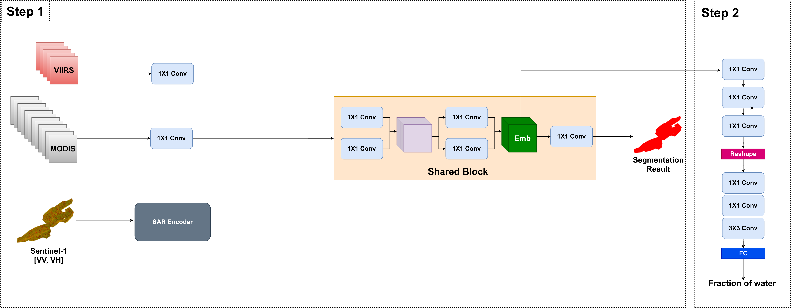

# Learning a Joint Embedding of Multiple Satellite Sensors: A Case Study for Lake Ice Monitoring

This repository contains the source code (tensorflow, coming soon!) and pre-trained model (coming soon!) corresponding to the paper: 

>[Learning a Joint Embedding of Multiple Satellite Sensors: A Case Study for Lake Ice Monitoring](https://ieeexplore.ieee.org/abstract/document/9906117) (published in the IEEE Transactions on Geoscience and Remote Sensing, 2022) 
> by Manu Tom, Yuchang Jiang, Emmanuel Baltsavias and Konrad Schindler

